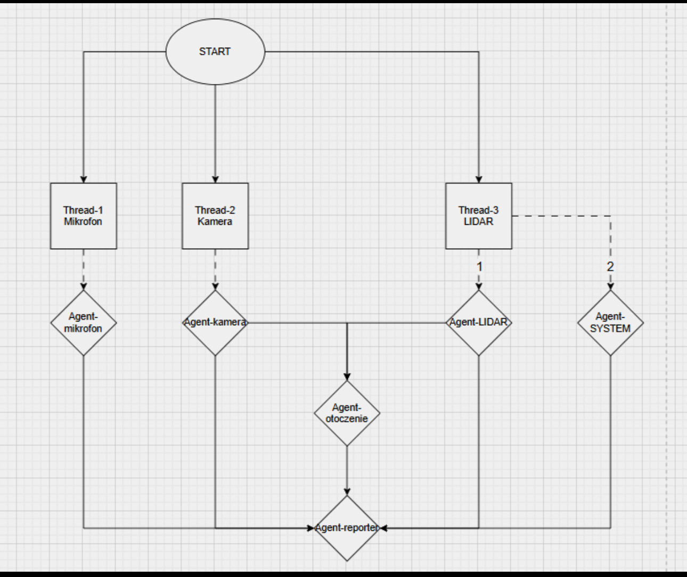

# WATUS – Voice Frontend (Watus + Reporter)

Low-latency voice frontend z rozpoznawaniem lidera (ECAPA / SpeechBrain), transkrypcją (Whisper via Faster-Whisper),
kolejką ZMQ oraz TTS (Piper). Łączy się z lokalnym backendem LLM (watus-ai) przez HTTP. **Kamera i jej pliki są obowiązkowe** – projekt korzysta z detekcji (Ultralytics RT-DETR/YOLO) i zapisuje kontekst do `camera.jsonl`.

<p align="center"> 
    
</p>

---

## Spis treści
1. [Opis](#Opis)
2. [Wymagania](#Wymagania)
3. [Szybki start (TL;DR)](#szybki-start-tldr)
4. [Instalacja — krok po kroku](#instalacja--krok-po-kroku)
   - [A. Biblioteki systemowe audio](#a-biblioteki-systemowe-audio)
   - [B. Wirtualne środowisko (venv)](#b-wirtualne-środowisko-venv)
   - [C. Python dependencies (bez Torch)](#c-Python-dependencies-bez-Torch)
   - [D. Instalacja PyTorch (wg systemu)](#d-instalacja-PyTorch-wg-systemu)
   - [E. Kamera / detekcja obrazu (OBOWIĄZKOWO)](#e-Kamera-/-detekcja-obrazu-obowiazkowo)
   - [F. Konfiguracja .env](#f-konfiguracja-.env)
   - [G. Piper (binarka + model)](#g-piper-binarka-i-model)
5. [Uruchomienie](#Uruchomienie)
6. [Konfiguracja i parametry](#Konfiguracja-i-parametry)
7. [Scenariusze](#Scenariusze)
8. [Troubleshooting](#Troubleshooting)
9. [Uwaga o plikach w repo](#Uwaga-o-plikach-w-repo)

---
## Opis
- **`watus.py`** – nasłuch audio (PortAudio), VAD (WebRTC), rozpoznawanie mówcy (ECAPA/SpeechBrain),
  transkrypcja (Faster-Whisper tylko; brak openai-whisper), zapis do `dialog.jsonl`,
  PUB `dialog.leader` tylko dla lidera, SUB `tts.speak` i odtwarzanie (Piper). Loguje czasy etapów (ASR, I/O) w terminalu.
- **`reporter.py`** – SUB `dialog.leader`, buduje meldunek (tekst + meta + czas systemowy + scenariusz + ostatnie dane z kamery),
  POST do backendu LLM (`/api1/process_question`), PUB `tts.speak` z odpowiedzią (dla Watusia). Ma retry dla 429/timeout i krótki fallback TTS.
- **`camera_runner.py` (OBOWIĄZKOWO)** – zapisuje do `camera.jsonl` informacje o wykrytych obiektach i jasności kadru.
  Domyślnie pracuje bez podglądu; snapshoty i overlay ogarnia komponent kamerowy (tu integrujemy tylko dane).

Przepływ:<br>
**Mic → Watus (VAD + STT + ECAPA) → dialog.jsonl → (leader→ZMQ) → Reporter → HTTP→LLM → (odp) ZMQ→Watus → TTS (Piper)**<br>
**Kamera (ciągle) → camera.jsonl → kontekst w meldunku Repotera**

---
## Wymagania
- Python 3.11+
- Wolne porty: 7780, 7781, 8781 oraz 8000 (LLM).
- **Piper** (binarka + model ONNX + config) i **piper-phonemize (biblioteka fonemizacji).**
  - **Głosy Piper (pl):**<br>
    - **Darkman medium:**<br>
      https://huggingface.co/rhasspy/piper-voices/tree/main/pl/pl_PL/darkman/medium
    - **Piper releases (binarki):**<br>
      https://github.com/rhasspy/piper/releases/tag/2023.11.14-2
    - **piper-phonemize (biblioteki .dll/.so/.dylib):**<br>
      https://github.com/rhasspy/piper-phonemize/releases/tag/2023.11.14-4
- Biblioteki systemowe: PortAudio + libsndfile.
- **ECAPA (SpeechBrain) – wymagane** do weryfikacji mówcy.
- **Kamera – obowiązkowa**: Ultralytics (RT-DETR/YOLO) + OpenCV + Torch + Torchvision (wg systemu).

---
## Szybki start (TL;DR)
```bash
git clone https://github.com/misialyna/watus_project.git
cd watus_project
```

## 1) venv
### macOS/Linux
```bash
    python3 -m venv .venv
    source .venv/bin/activate
```
### Windows (PowerShell)
```bash
    python -m venv .venv
    .\.venv\Scripts\Activate.ps1
```

## 2) Deps (bez Torcha) + .env
```bash
  pip install -U pip wheel
  pip install -r requirements.txt
  cp .env.example .env
  # uzupełnij: PIPER_BIN, PIPER_MODEL, PIPER_CONFIG, urządzenia audio, ścieżki kamery
```
## WAŻNE:
W linii 30 w `reporter.py` zmień ścieżkę absolutną na swoją!
```bash
  CAMERA_JSONL = os.environ.get("CAMERA_JSONL", "/Users/michalinamoszynska/Documents/GitHub/watus_project/camera.jsonl")
  #zmień na własnąścieżkę absolutną 
  CAMERA_JSONL = os.environ.get("CAMERA_JSONL", "Twoja_sciezka_absolutna.")

```
## 3) Backend LLM (watus-ai)
Repo:<br>
https://github.com/pasjonatprogramowania/watus-ai
```bash
  uvicorn src.main:app --host 127.0.0.1 --port 8000 --reload
```

## 4) Uruchomienie (w 3 terminalach)
```bash
python3 reporter.py
```
```bash
# kamera – patrz sekcja E
python3 camera_runner.py --jsonl ./camera.jsonl --device 0 --rt 1   # RT-DETR (zalecane)
# lub fallback YOLO:
# python3 camera_runner.py --jsonl ./camera.jsonl --device 0
```
```bash
python3 watus.py
```
---

# Instalacja — krok po kroku
## A. Biblioteki systemowe audio
### macOS
```bash
brew install portaudio libsndfile
```
### Ubuntu/Debian/Raspberry Pi
```bash
sudo apt update
sudo apt install -y libportaudio2 libsndfile1
```
### Windows
Zwykle nic nie trzeba. Jeśli są błędy z PortAudio – doinstaluj odpowiedni pakiet.

---
# B. Wirtualne środowisko (venv)
### macOS / Linux
```bash
python3 -m venv .venv
source .venv/bin/activate
```
### Windows (PowerShell)
```bash
python -m venv .venv
.\.venv\Scripts\Activate.ps1
```

---
# C. Python dependencies (bez Torch)
Plik `requirements.txt` w repo zawiera wszystko poza `torch`/`torchaudio`/`torchvision` i paczkami kamery:
```ini
numpy==1.26.4
sounddevice==0.4.6
soundfile==0.12.1
webrtcvad==2.0.10
faster-whisper==1.0.3
pyzmq==25.1.2
requests==2.32.3
python-dotenv==1.0.1
fastapi==0.112.2
uvicorn==0.30.6
speechbrain==0.5.16
```
Instalacja:
```bash
pip install -U pip wheel
pip install -r requirements.txt
```
**Uwaga**: nie instalujemy tu Torcha – zrobimy to świadomie w kolejnym kroku,
aby dobrać poprawne koło dla danego systemu (eliminujemy konflikty).

---
# D. Instalacja PyTorch (wg systemu)
### macOS (Intel / Apple Silicon)
```bash
pip install "torch==2.6.*"
# (opcjonalnie) bezpieczny fallback na CPU gdy MPS nie wspiera operacji:
export PYTORCH_ENABLE_MPS_FALLBACK=1   # bash/zsh
```
- ECAPA (SpeechBrain) skorzysta z MPS, Faster-Whisper i tak działa głównie na CPU – to OK.

### Linux (CPU)
```bash
pip install --index-url https://download.pytorch.org/whl/cpu "torch==2.6.*"
```

### Linux / Windows (NVIDIA CUDA 12.4 – rekomendowane dla kamery na GPU)
```bash
pip install --index-url https://download.pytorch.org/whl/cu124 "torch==2.6.*"
```

### Windows (CPU)
```bash
pip install --index-url https://download.pytorch.org/whl/cpu "torch==2.6.*"
```

---
## Instalacja torchvision (dopasuj do zainstalowanego Torch)
Po zainstalowaniu Torch dołóż zgodną wersję **torchvision**:
### macOS (CPU/MPS):
```bash
pip install "torchvision==0.21.*"
```
### Linux / Windows – CPU:
```bash
pip install --index-url https://download.pytorch.org/whl/cpu "torchvision==0.21.*"
```
### Linux / Windows – CUDA 12.4 (GPU dla kamery):
```bash
pip install --index-url https://download.pytorch.org/whl/cu124 "torchvision==0.21.*"
```
> `torchaudio` **nie jest wymagane** dla Watus/Reporter/Kamery i często generuje zbędne konflikty (zwłaszcza na macOS). Instaluj tylko, jeśli naprawdę potrzebujesz.

---
# E. Kamera / detekcja obrazu (OBOWIĄZKOWO)
Jeżeli chcesz, by Reporter wzbogacał meldunki o kontekst wizji, **kamera musi działać** – uruchom `camera_runner.py`, który dopisuje rekordy JSONL do `camera.jsonl`.

Zależności kamery (instaluj **po** Torchu/Torchvision):
```bash
pip install "ultralytics==8.3.0" opencv-python-headless
```

**Ważne pliki w repo:**<br>
- `camera_runner.py` – runner zapisujący do `camera.jsonl`<br>
- `camera.jsonl` – output JSONL (czytany przez `reporter.py`)<br>
- katalog `oczyWatusia/` – kod RT-DETR; **wagi** `rtdetr-l.pt` (nie commitujemy, pobierz i umieść w tym katalogu)<br>
- katalog `oczyWatusia_extracted/` – może pojawiać się automatycznie przy pierwszym uruchomieniu; jest w `.gitignore`<br>

**Uruchomienie (przykłady):**
```bash
# urządzenie 0 (np. wbudowana kamera), fallback YOLO
python3 camera_runner.py --jsonl ./camera.jsonl --device 0

# urządzenie 0, RT-DETR (zalecane – szybsze i dokładniejsze, bez podglądu)
python3 camera_runner.py --jsonl ./camera.jsonl --device 0 --rt 1
```
`camera_runner.py` działa w tle, bez podglądu. Reporter co ~2.5 s (domyślnie `CAMERA_WINDOW_SEC`) bierze ostatni wpis.

---
# F. Konfiguracja .env
Skopiuj i uzupełnij:
```bash
cp .env.example .env
```
Kluczowe pola (dopasuj do swoich ścieżek/urządzeń):
```ini
# ==== ZMQ ====
ZMQ_PUB_ADDR=tcp://127.0.0.1:7780
ZMQ_SUB_ADDR=tcp://127.0.0.1:7781

# ==== STT (Faster-Whisper only) ====
ASR_BACKEND=faster
WHISPER_MODEL=small                # mapowane w kodzie na guillaumekln/faster-whisper-small
WHISHER_DEVICE=cpu                 # cuda na Linux/Windows z NVIDIA
WHISPER_COMPUTE_TYPE=int8
WATUS_CPU_THREADS=8
WHISPER_NUM_WORKERS=1

# ==== Audio / VAD ====
WATUS_INPUT_DEVICE=1               # ustaw po numerze z listy urządzeń wypisywanych przez watus.py
WATUS_OUTPUT_DEVICE=2
WATUS_SR=16000
WATUS_BLOCKSIZE=160                # 10 ms @ 16 kHz (niska latencja)
WATUS_VAD_MODE=1
WATUS_VAD_MIN_MS=280
WATUS_SIL_MS_END=650
ASR_MIN_DBFS=-34
WATUS_START_MIN_FRAMES=8
WATUS_START_MIN_DBFS=-30
WATUS_MIN_MS_BEFORE_ENDPOINT=500
END_AT_DBFS_DROP=0
EMIT_COOLDOWN_MS=300
MAX_UTT_MS=6500
WAIT_REPLY_S=0.9

# ==== TTS Piper ====
PIPER_BIN=/absolute/path/to/models/piper/piper
PIPER_MODEL=/absolute/path/to/models/piper/pl_PL-darkman-medium.onnx
PIPER_CONFIG=/absolute/path/to/models/piper/pl_PL-darkman-medium.onnx.json

# ==== LLM HTTP (lokalny backend) ====
LLM_HTTP_URL=http://127.0.0.1:8000/api1/process_question
HTTP_TIMEOUT=20
LLM_HTTP_TIMEOUT=30

# ==== Logi / meta ====
LOG_DIR=./
DIALOG_PATH=dialog.jsonl

# (ECAPA)
SPEAKER_VERIFY=1
SPEAKER_REQUIRE_MATCH=1

# ==== Scenariusze ====
WATUS_SCENARIOS_DIR=./scenarios_text
SCENARIO_ACTIVE_PATH=./scenarios_text/active.jsonl

# ==== Kamera / wizja ====
CAMERA_NAME=cam_front
CAMERA_DEVICE=0
CAMERA_JSONL=./camera.jsonl
VISION_SCORE_THR=0.5
VISION_WRITE_HZ=1.0
VISION_USE_RTDETR=1
RTDETR_DIR=./oczyWatusia
RTDETR_WEIGHTS=./oczyWatusia/rtdetr-l.pt
CAMERA_WINDOW_SEC=2.5

# ==== Wątki BLAS ====
OMP_NUM_THREADS=4
MKL_NUM_THREADS=4

# (macOS) pozwala SpeechBrain spadać na CPU, gdy MPS nie wspiera op
PYTORCH_ENABLE_MPS_FALLBACK=1
```

---
# G. Piper (binarka + model)
**Binarka Piper**<br>
https://github.com/rhasspy/piper/releases/tag/2023.11.14-2<br>
Wypakuj np. do `models/piper/` i ustaw `PIPER_BIN` w `.env`.<br><br>

**Głos PL („darkman/medium”)**<br>
https://huggingface.co/rhasspy/piper-voices/tree/main/pl/pl_PL/darkman/medium<br>
Zapisz `.onnx` i `.onnx.json` w `models/piper/` i ustaw w `.env`.<br><br>

**piper-phonemize (biblioteki fonemizacji – wymagane)**<br>
https://github.com/rhasspy/piper-phonemize/releases/tag/2023.11.14-4<br>
- macOS: paczka `piper-phonemize-...-macos-...` → skopiuj `.dylib` do `models/piper/` lub `models/piper/piper-phonemize/lib/`.<br>
  Przy błędzie typu `dyld: Library not loaded: @rpath/libpiper_phonemize...`:<br>
  ```bash
  brew install onnxruntime re2
  # ew. skopiuj podstawowe dylib-y obok binarki piper
  ```
- Linux: paczka `piper-phonemize-...-linux-...` → `.so` obok binarki albo do `/usr/local/lib` (+ `ldconfig`), w razie braków:<br>
  ```bash
  sudo apt install -y espeak-ng-data libespeak-ng1 libsndfile1
  ```
- Windows: paczka `piper-phonemize-...-win-...` → `piper_phonemize.dll` obok `piper.exe` (lub dodaj folder do `PATH`).

---
## Uruchomienie
### Backend LLM (repo watus-ai)
https://github.com/pasjonatprogramowania/watus-ai
```bash
uvicorn src.main:app --host 127.0.0.1 --port 8000 --reload
```

### Reporter (to repo)
```bash
python3 reporter.py
# health: http://127.0.0.1:8781/health
```

### Kamera (to repo, osobny terminal)
```bash
# YOLO (fallback)
python3 camera_runner.py --jsonl ./camera.jsonl --device 0
# RT-DETR (zalecane)
python3 camera_runner.py --jsonl ./camera.jsonl --device 0 --rt 1
```

### Watus (to repo)
```bash
python3 watus.py
```

Watus loguje: **LISTENING / THINKING / SPEAKING / IDLE** oraz czasy etapów.<br>
`unknown_*` → zapis do `dialog.jsonl`, **brak** wysyłki do LLM.<br>
`leader_*` → zapis i wysyłka do LLM (ZMQ → Reporter).

---
## Konfiguracja i parametry
### Latencja / VAD
- `WATUS_BLOCKSIZE=160` → 10 ms @ 16 kHz (niska latencja)<br>
- `WATUS_VAD_MIN_MS=280`, `WATUS_SIL_MS_END=650` → krótkie, naturalne kończenie tur<br>
- `WAIT_REPLY_S=0.9` → po wysyłce pytania czekamy na TTS, nie zbieramy „śmieci”

### ECAPA (weryfikacja mówcy)
- `SPEAKER_VERIFY=1`, `SPEAKER_REQUIRE_MATCH=1` – odpowiadamy tylko liderowi<br>
- Progi (w `watus.py` / `.env`) uwzględniają „sticky” tolerancję (emocje/zmęczenie)

### LLM
- `LLM_HTTP_URL=http://127.0.0.1:8000/api1/process_question`, `HTTP_TIMEOUT=20`<br>
- Reporter dodaje `SYS_TIME` / `SCENARIO` / `CAMERA_*` (ostatnie okno ~2.5 s)

---
## Scenariusze
- Pliki tekstowe w `scenarios_text/` (np. persona, styl, ograniczenia).<br>
- Aktywny scenariusz wskazuje `SCENARIO_ACTIVE_PATH` (domyślnie `scenarios_text/active.jsonl`).<br>
- Do szybkiej zmiany skorzystaj z helpera `set_scenario.py` albo podmień plik `active.jsonl`.

---
## Troubleshooting
- **Zajęte porty (7780/7781)** – zamknij poprzednie procesy `watus.py`/`reporter.py`.<br><br>
- **Brak głosu z Piper / błędy .dll/.so/.dylib** – sprawdź instalację piper-phonemize i (na macOS) `onnxruntime` + `re2`.<br>
  Upewnij się, że biblioteki leżą obok binarki lub są w `DYLD_LIBRARY_PATH`/`PATH`/`LD_LIBRARY_PATH`.<br><br>
- **macOS – torchvision/torchaudio** – `torchaudio` nie jest potrzebny; `torchvision` pinuj do `0.21.*`.<br><br>
- **GPU dla kamery (CUDA 12.4)** – utrzymuj spójny zestaw `torch==2.6.*` + `torchvision==0.21.*` z indexem `cu124`.<br><br>
- **Ultralytics/RT-DETR** – instaluj **po** Torchu; pin `ultralytics==8.3.0` (z tym testowano).<br><br>
- **Mikrofon (macOS)** – `Settings → Privacy & Security → Microphone` (zezwól Terminalowi/IDE).<br><br>
- **Wysoka latencja** – sprawdź `WATUS_BLOCKSIZE=160`, `SIL_MS_END≈600–700`, `WHISPER_COMPUTE_TYPE` (`int8` na CPU / `float16` na CUDA).

---
## Uwaga o plikach w repo
- Modele i binarki (Piper/Whisper/ECAPA/RT-DETR) nie są dołączone – pobierz je linkami i ustaw w `.env`.<br>
- Logi (`dialog.jsonl`, `meldunki.jsonl`, `camera.jsonl`) oraz katalogi cache/ekstrakcji (np. `oczyWatusia_extracted/`) są wykluczone przez `.gitignore`.<br>
- **Nie usuwaj** katalogu `oczyWatusia/` ani placeholderu wagi `rtdetr-l.pt`, jeśli używasz kamery. Katalog `oczyWatusia_extracted/` może się pojawiać automatycznie – jest ignorowany w Git.
---
# JAK URUCHOMIĆ?
1) Wybierz scenariusz (opcjonalnie, ale zalecane)
Scenariusze są w `./scenarios_text/`. <br>
Aby ustawić aktywny:
```bash
    python3 set_scenario.py          # interaktywnie
    # lub:
    python3 set_scenario.py <id>     # nazwa pliku bez rozszerzenia
```
Aktywny jest ostatni wpis w `scenarios_text/active.jsonl`.
3) Uruchom backend LLM (repo `watus-ai`)
<br>**Repo:**<br> https://github.com/pasjonatprogramowania/watus-ai<br>
```bash
  uvicorn src.main:app --host 127.0.0.1 --port 8000 --reload
```
4) Uruchom Reporter (terminal A)
```bash
    python3 reporter.py
    # zdrowie serwisu:
    # http://127.0.0.1:8781/health
```
5) Uruchom kamerę (terminal B)
**RT-DETR** (zalecane, bez podglądu):
```bash
python3 camera_runner.py --jsonl ./camera.jsonl --device 0 --rt 1
```
**Fallback YOLO** (gdy RT-DETR nie jest gotowy):
```bash
    python3 camera_runner.py --jsonl ./camera.jsonl --device 0
```
Kamera zapisuje `camera.jsonl`; `reporter.py` automatycznie dołącza ostatnie detekcje (okno `CAMERA_WINDOW_SEC`) do meldunku wysyłanego do LLM.
6) Uruchom Watus (terminal C)
```bash
python3 watus.py
```
Na starcie Watus wypisze listę urządzeń audio. Dopasuj `WATUS_INPUT_DEVICE` i `WATUS_OUTPUT_DEVICE` w `.env`, jeśli trzeba, i uruchom ponownie.

---
## Pierwsza rozmowa (przepływ)
- Poczekaj, aż Watus pokaże w terminalu `[Watus][STATE] LISTENING`.
- Powiedz krótko do mikrofonu, np. „Hej, WATUSiu” i dokończ zdanie/pytanie naturalnie.
- Pierwsza poprawna wypowiedź enroluje Twój głos jako lidera (ECAPA).<br>

**Watus wykona**: `LISTENING → THINKING → SPEAKING` i odtworzy odpowiedź (Piper).<br>

**Kolejne wypowiedzi**: Watus odpowiada tylko liderowi (SPEAKER_REQUIRE_MATCH=1).
- Głosy innych osób są logowane jako `unknown_*` i nie idą do LLM.
---
## Jak sprawdzić, że wszystko działa?
- Reporter wypisuje `„MELDUNEK”` i pokazuje m.in.` [SCENARIO=...], [CAMERA=...], [SPEECH=...]` oraz `USER: ...`.
- W logu widać też `„HTTP→/HTTP←”` i publikację `tts.speak`.
- Watus po odpowiedzi Piper przechodzi znów w `LISTENING`.
- W logach są czasy etapów: `ASR_ms=...`, `TTS_play_ms=...`, itp.
- Kamera tworzy i dopisuje do `camera.jsonl`; w `reporter.py` w meldunku pojawia się `[VISION=...]` z podsumowaniem detekcji.
---
## Typowe problemy i szybkie rozwiązania
- Brak odpowiedzi / TTS milczy → sprawdź ścieżki w `.env` `(PIPER_BIN/MODEL/CONFIG)` i biblioteki `piper-phonemize`.
- `„Address already in use (7780/7781)”` → zakończ poprzednie watus.py/reporter.py.
- Kamera nie startuje → najpierw zainstaluj Torch + Torchvision zgodnie z systemem, potem `ultralytics==8.3.0` i `opencv-python-headless`.
- ECAPA wolna lub błąd na macOS → zainstaluj torch==2.6.* (MPS), ustaw `PYTORCH_ENABLE_MPS_FALLBACK=1`.
- Wysoka latencja → w `.env` ustaw `WATUS_BLOCKSIZE=160`, `WHISPER_COMPUTE_TYPE=int8` (CPU) lub `WHISPER_DEVICE=cuda + compute float16` (GPU).
---
## Porządek uruchamiania (skrót)
- LLM → uvicorn ...
- Reporter → `python3 reporter.py`<br>
**Kamera → `python3 camera_runner.py --jsonl ./camera.jsonl --device 0 --rt 1`**
<br>**Watus → `python3 watus.py`**<br>
**Zatrzymywanie**: Ctrl+C w każdym z terminali.<br>
**Logi runtime**: `dialog.jsonl`, `meldunki.jsonl`, `camera.jsonl` (ignorowane przez Git).